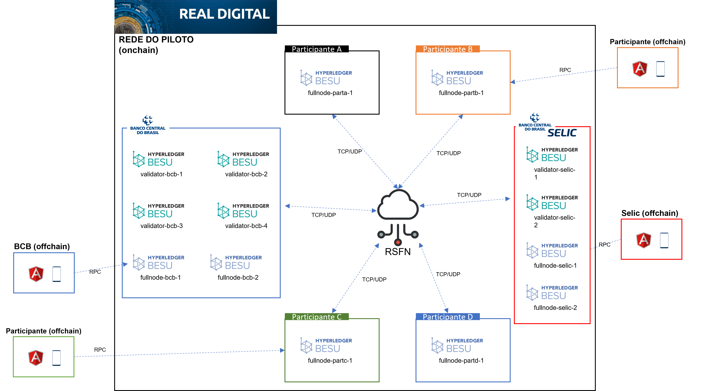

# Arquitetura do piloto do Real Digital

## Objetivo

Esta documentação tem como objetivo apresentar a arquitetura definida para o piloto do Real Digital.

Por se tratar de um piloto em ambiente de testes, a arquitetura apresentada está sujeita a constantes evoluções que serão refletidas na documentação apresentada.

## Hyperledger Besu para redes privadas

**Versão do Hyperledger Besu** utilizada na rede do piloto do Real Digital:
    [23.10.1](https://github.com/hyperledger/besu/releases/tag/23.10.1).

Para uso de versões superiores, a compatibilidade deve ser verificada com a equipe de desenvolvimento do piloto. Ao longo do projeto poderão ser testadas atualizações de versões.

**Consenso** utilizado na rede do piloto do Real Digital:
    [QBFT](https://besu.hyperledger.org/private-networks/how-to/configure/consensus/qbft/)

**Permissionamento** do nó do participante na rede:
    A permissão é realizada [onchain](https://besu.hyperledger.org/private-networks/concepts/permissioning/onchain/#permissioning-contracts) pelo Banco Central do Brasil. Mais detalhes no passo de [conexão com a rede](ingresso.md).

Será utilizada a [versão 2](https://besu.hyperledger.org/private-networks/how-to/use-permissioning/onchain/#specify-the-permissioning-contract-interface-version) do contract interface para o permissionamento **(permissions-nodes-contract-version)**.

## Topologia

A imagem abaixo mostra a arquitetura inicial proposta para a rede do piloto do Real Digital.

&nbsp;

&nbsp;

- A comunicação entre os nós da rede se dá por meio da RSFN.

- Cada participante do piloto, à exceção do Banco Central do Brasil, possui um único nó na rede.

- De forma a garantir disponibilidade e resiliência à rede foram disponibilizados:
  - no Banco Central do Brasil (Brasília): 4 validadores e 2 fullnodes, implantados em sites diferentes.
  - no Banco Central do Brasil (RJ, Selic - infraestrutura apartada): 2 validadores e 2 fullnodes, implantados em sites diferentes.

- Todo tráfego que passará na RSFN será P2P (TCP/UDP).

- Não haverá tráfego RPC na RSFN, ou seja, as portas RPCs devem ser liberadas apenas no âmbito de cada participante para acesso ao seu próprio nó.

- As portas RPC não devem estar abertas na rede e recomenda-se que, mesmo na rede interna, seja configurado controle de acesso por firewall e por autenticação.

- Não é necessário configurar um DNS para o nó do participante.

[<<< Voltar](README.md)
